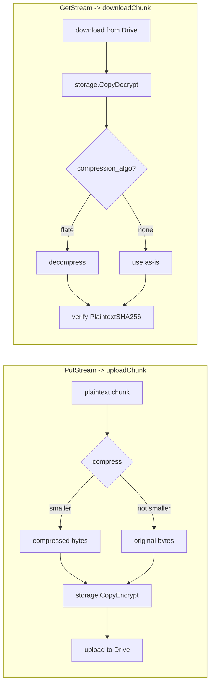

# Per-Chunk Compression — Implementation Plan

**Status: proposed, not yet implemented.** This document is for review before
any code is written. Once approved, implement it in the phase order given in
§8.

## 1. Goal

Shrink what actually gets uploaded to each pooled Google Drive account by
compressing chunk plaintext before it's encrypted, and transparently
decompressing on the way back out — without touching the existing
integrity/hash guarantees, without breaking any chunk already stored by the
current (uncompressed) code, and without expanding scope beyond `drivepool`.

**Scope**: `drivepool/pool.go`'s `PutStream`/`GetStream` chunking path only.
The P2P subsystem (`server.go`, `p2p/`, `storage.Store`) does not chunk files
at all — it stores/retrieves one whole CAS-addressed blob per key — so
compression there is a different, unrelated piece of work and is explicitly
**out of scope** here. The new compression helper is added to the shared
`storage` package (matching how `storage.CopyEncrypt`/`CopyDecrypt` already
live there for both subsystems to use), but only `drivepool` will call it.

## 2. Where it fits in the existing pipeline

Today, per chunk: `PutStream` reads `chunkSize` bytes → `uploadChunk`
encrypts them with `storage.CopyEncrypt` → uploads the ciphertext. `GetStream`
downloads ciphertext → `downloadChunk` decrypts with `storage.CopyDecrypt` →
verifies against `chunk.PlaintextSHA256`.

Compression is inserted as one extra step, strictly *before* encryption and
strictly *after* decryption — compressing ciphertext is pointless (AES output
is high-entropy and does not compress), so it must happen on plaintext only,
which matches what you described:



Everything else — `PutStream`'s read/hash/placement loop, `GetStream`'s
ordered-channel reassembly, the final `content_hash` check against
`vf.ContentHash` — is untouched. Those two functions never see compressed
bytes; only `uploadChunk`/`downloadChunk` do.

## 3. Key design decisions

### 3.1 Compress adaptively, per chunk — never blindly

Not all data compresses. Already-compressed or encrypted content (jpg, mp4,
zip, most media) will not shrink and may even grow slightly under a naive
codec. So `uploadChunk` **tries** compressing and only keeps the compressed
form if it's actually smaller than the original:

```go
payload, algo := plaintext, storage.CompressionNone
if compressed, err := storage.CompressBytes(plaintext); err == nil && len(compressed) < len(plaintext) {
    payload, algo = compressed, storage.CompressionFlate
}
```

This means the decision is per-chunk, not per-file — a file with a
compressible header and an incompressible body still gets the benefit on
whichever chunks actually shrink.

### 3.2 Algorithm: stdlib `compress/flate`, no new dependency

`compress/flate` (raw DEFLATE, no gzip/zlib header) ships in the Go standard
library — consistent with this repo's general preference for stdlib crypto
(`crypto/aes`, `crypto/cipher` in `storage/crypto.go`) over third-party
dependencies where stdlib suffices. Raw `flate` (vs. `gzip`) skips ~18 bytes
of header/CRC32 trailer we don't need, since chunk integrity is already
independently guaranteed by `PlaintextSHA256` (post-decompress) and
`CiphertextMD5` (post-encrypt) — no reason to pay for a second checksum
layer.

The `compression_algo` column (§4) is a free-text string, not a bool — so a
stronger future codec (e.g. `github.com/klauspost/compress/zstd`, better
ratio *and* speed than stdlib flate) can be added later as a second
recognized value without another schema change. Not proposed for this pass;
called out in §9 as a follow-up.

### 3.3 Backward compatibility is the load-bearing constraint

This is the part most likely to "break something" if done carelessly:
**chunks already uploaded by the current code have no compression applied,
and there is no way to tell that from the ciphertext bytes alone.** The only
place that fact can be recorded is a new manifest column, and every already
existing chunk row needs a correct value in it retroactively, or
`GetStream` will try to `flate`-decompress plain ciphertext-decrypted bytes
and fail every existing file in the pool.

Handled by:
- A new `chunks.compression_algo` column, `NOT NULL DEFAULT 'none'`.
- The migration's `UP` step **backfills every existing row** to `'none'`
  (the default handles that automatically) and backfills `compressed_size =
  plaintext_size` for them (§4) — so old rows are indistinguishable in
  behavior from a chunk that was *tried* and *not* compressed, which is
  exactly correct: they weren't.
- `downloadChunk` branches on `chunk.CompressionAlgo`; `"none"` (or, as a
  defensive fallback, `""`) skips decompression entirely and returns the
  decrypted bytes as-is, unchanged from today's behavior.

Net effect: every chunk uploaded before this change downloads exactly as it
does today. Nothing already in a user's pool needs to be re-uploaded or
migrated data-wise — only the manifest schema changes, once.

### 3.4 Placement (`placementTracker`) is intentionally left alone

`PutStream` reserves placement budget via `tracker.reserve(n)` using the
**uncompressed** chunk size `n`, before compression happens (compression runs
later, inside each chunk's upload goroutine, in `uploadChunk`). This plan
does not change that ordering. Consequence: the tracker's in-memory
"available space" bookkeeping is always conservative — it reserves at least
as much as will actually be used, never less — so there's no risk of
over-committing an account's real quota. The only downside is placement
balance is computed on estimated (pre-compression) sizes rather than actual
post-compression sizes; for a per-chunk optimization loop this is a
reasonable trade — computing real placement from actual compressed size
would mean compressing *before* picking an account, serializing what's
currently a parallelizable step. Real Drive usage (`Quota.Usage`, queried
live via `gdrive.Client.Quota`) already reflects true post-compression bytes
on disk regardless — so `rhino status`/`account list` correctly show the
space actually saved with no extra code.

## 4. Data model changes

### 4.1 New columns on `chunks`

| Column | Type | Notes |
| --- | --- | --- |
| `compression_algo` | `TEXT NOT NULL DEFAULT 'none'` | `'none'` or `'flate'` today; free-text so a future codec is just a new recognized value |
| `compressed_size` | `BIGINT NOT NULL` | Size in bytes of what was actually encrypted (i.e. the compressed payload when `algo != 'none'`, otherwise equal to `plaintext_size`) — nullable during backfill, tightened to `NOT NULL` at the end of the same migration |

`plaintext_size` and `plaintext_sha256` keep their exact current meaning
(size/hash of the original, uncompressed bytes) — untouched.

### 4.2 Migration — `db/migrations/0002_add_chunk_compression.up.sql`

```sql
ALTER TABLE chunks ADD COLUMN compression_algo TEXT NOT NULL DEFAULT 'none';
ALTER TABLE chunks ADD COLUMN compressed_size BIGINT;

UPDATE chunks SET compressed_size = plaintext_size WHERE compressed_size IS NULL;

ALTER TABLE chunks ALTER COLUMN compressed_size SET NOT NULL;
```

`db/migrations/0002_add_chunk_compression.down.sql`:

```sql
ALTER TABLE chunks DROP COLUMN compressed_size;
ALTER TABLE chunks DROP COLUMN compression_algo;
```

Follows the existing numbered-plain-SQL-file convention (`db.Migrate`,
golang-migrate, embedded via `go:embed`) — no `AutoMigrate`, same rationale
already documented in `er_diagram.md`'s "Why golang-migrate, not
AutoMigrate". `ADD COLUMN ... DEFAULT 'none'` is a metadata-only change on
Postgres 11+ (no full table rewrite); the `UPDATE` backfilling
`compressed_size` does scan/rewrite every existing row, which is fine at
this project's scale but worth knowing if `chunks` is ever huge in
production — not a blocker here, just a note for later.

**Rollback caveat**: the `.down.sql` is provided for convention/dev-iteration
symmetry, but rolling back the schema in production *after* real compressed
chunks exist is not actually safe on its own — the Go binary would also need
to be rolled back in lockstep, or old code has no column to read and no way
to know a chunk needs decompressing. This is no different from any other
schema rollback with live dependent data; flagged here so it's not a
surprise later.

### 4.3 `drivepool/manifest/models.go` — `Chunk` struct

```go
type Chunk struct {
    ID              int64     `gorm:"primaryKey"`
    UserID          string    `gorm:"not null;column:user_id"`
    VirtualFileID   int64     `gorm:"not null;column:virtual_file_id;uniqueIndex:idx_chunks_vf_idx"`
    Index           int       `gorm:"not null;column:idx;uniqueIndex:idx_chunks_vf_idx"`
    AccountID       *string   `gorm:"column:account_id"`
    RemoteFileID    string    `gorm:"not null;column:remote_file_id"`
    RemoteFolderID  string    `gorm:"not null;column:remote_folder_id"`
    PlaintextSize   int64     `gorm:"not null;column:plaintext_size"`
    PlaintextSHA256 string    `gorm:"not null;column:plaintext_sha256"`
    CiphertextMD5   string    `gorm:"not null;column:ciphertext_md5"`
    CompressionAlgo string    `gorm:"not null;column:compression_algo;default:none"` // NEW
    CompressedSize  int64     `gorm:"not null;column:compressed_size"`               // NEW
    UploadedAt      time.Time `gorm:"not null;column:uploaded_at"`
}
```

`manifest.go`'s `AddChunk`/`ListChunks` need **no changes** — they already
persist/read the whole struct generically via GORM, and the only
`manifest.Chunk{...}` literal in the codebase (`pool.go:514`, inside
`PutStream`) uses keyed fields, so adding new fields there is additive and
doesn't break anything else that constructs one (confirmed: it's the only
call site).

## 5. Code changes

### 5.1 New file — `storage/compress.go`

Mirrors the shape of `storage/crypto.go` (small, dependency-free, symmetric
pair of functions):

```go
package storage

import (
	"bytes"
	"compress/flate"
	"fmt"
	"io"
)

const (
	CompressionNone  = "none"
	CompressionFlate = "flate"
)

// CompressBytes compresses data with raw DEFLATE. The caller decides
// whether the result is worth keeping (see drivepool's uploadChunk) —
// this always returns the compressed form, even if it turns out larger.
func CompressBytes(data []byte) ([]byte, error) {
	var buf bytes.Buffer
	w, err := flate.NewWriter(&buf, flate.DefaultCompression)
	if err != nil {
		return nil, err
	}
	if _, err := w.Write(data); err != nil {
		return nil, err
	}
	if err := w.Close(); err != nil {
		return nil, err
	}
	return buf.Bytes(), nil
}

// DecompressBytes reverses CompressBytes.
func DecompressBytes(data []byte) ([]byte, error) {
	r := flate.NewReader(bytes.NewReader(data))
	defer r.Close()
	var buf bytes.Buffer
	if _, err := io.Copy(&buf, r); err != nil {
		return nil, fmt.Errorf("storage: decompress: %w", err)
	}
	return buf.Bytes(), nil
}
```

`flate.DefaultCompression` (level 6) as the balanced default — fast enough
not to bottleneck upload throughput, good enough ratio for typical
compressible content (text/logs/code/JSON). Not exposed as a tunable for
this pass; see §9.

### 5.2 `drivepool/pool.go` — `uploadChunk`

```go
func (p *Pool) uploadChunk(ctx context.Context, acc *Account, folders *folderResolver, fileID string, fileKey []byte, idx int, plaintext []byte) (*uploadedChunk, error) {
	payload, algo := plaintext, storage.CompressionNone
	if compressed, err := storage.CompressBytes(plaintext); err == nil && len(compressed) < len(plaintext) {
		payload, algo = compressed, storage.CompressionFlate
	}

	var ciphertext bytes.Buffer
	md := md5.New()
	if _, err := storage.CopyEncrypt(fileKey, bytes.NewReader(payload), io.MultiWriter(&ciphertext, md)); err != nil {
		return nil, fmt.Errorf("drivepool: encrypt chunk %d: %w", idx, err)
	}
	plaintextSum := sha256.Sum256(plaintext) // hash of the ORIGINAL bytes, unchanged
	plaintextHash := hex.EncodeToString(plaintextSum[:])
	ciphertextMD5 := hex.EncodeToString(md.Sum(nil))

	// ... EnsureFolder / Upload unchanged ...

	return &uploadedChunk{
		index:           idx,
		accountID:       acc.ID,
		remoteFileID:    remoteFileID,
		remoteFolderID:  folderID,
		plaintextSize:   int64(len(plaintext)),
		plaintextSHA256: plaintextHash,
		ciphertextMD5:   ciphertextMD5,
		compressionAlgo: algo,             // NEW
		compressedSize:  int64(len(payload)), // NEW
	}, nil
}
```

Only the *input* to `storage.CopyEncrypt` changes (`payload` instead of
`plaintext`); the hash/upload/error-handling/cleanup logic around it is
untouched.

`uploadedChunk` struct gains the two matching fields; `PutStream`'s existing
loop that turns each `*uploadedChunk` into a `manifest.Chunk{...}` (line
~514) gains two more keyed fields (`CompressionAlgo: uc.compressionAlgo,
CompressedSize: uc.compressedSize`) — everything else in `PutStream` is
unchanged.

### 5.3 `drivepool/pool.go` — `downloadChunk`

```go
func (p *Pool) downloadChunk(ctx context.Context, fileKey []byte, chunk manifest.Chunk) ([]byte, error) {
	// ... account lookup / Download unchanged ...

	var decrypted bytes.Buffer
	if _, err := storage.CopyDecrypt(fileKey, rc, &decrypted); err != nil {
		return nil, fmt.Errorf("drivepool: decrypt chunk %d: %w", chunk.Index, err)
	}

	plaintext := decrypted.Bytes()
	if chunk.CompressionAlgo == storage.CompressionFlate {
		out, err := storage.DecompressBytes(plaintext)
		if err != nil {
			return nil, fmt.Errorf("drivepool: decompress chunk %d: %w", chunk.Index, err)
		}
		plaintext = out
	}
	// chunk.CompressionAlgo == "none" (or "", defensively) -> use decrypted bytes as-is,
	// exactly today's behavior.

	sum := sha256.Sum256(plaintext)
	if got := hex.EncodeToString(sum[:]); got != chunk.PlaintextSHA256 {
		return nil, fmt.Errorf("drivepool: chunk %d hash mismatch: got %s want %s", chunk.Index, got, chunk.PlaintextSHA256)
	}
	return plaintext, nil
}
```

`GetStream` itself (the ordered-channel reassembly, the final
`vf.ContentHash` check) calls `downloadChunk` and uses its return value
exactly as it does today — **zero changes needed there**, since
decompression is fully contained inside `downloadChunk`.

## 6. What does *not* change

- `PutStream`'s chunking/read/placement/concurrency loop.
- `GetStream`'s ordered reassembly and final content-hash check.
- `placementTracker` / `pickAccount`.
- `storage.CopyEncrypt`/`CopyDecrypt` and the AES-256-CTR pipeline itself.
- `manifest.go`'s query methods (`AddChunk`, `ListChunks`, etc.) — GORM
  persists the new struct fields automatically.
- Anything in `server.go` / `p2p/` (no gob-registered message types are
  involved here — this never crosses the network as a discrete `RPC`
  payload; chunk bytes are already streamed raw, same as today).
- `backend/handlers.go` and the frontend — both only ever surface
  `VirtualFile.Size` (the original file size), never a per-chunk field, so
  the API/UI are unaffected. Confirmed via grep: no reference to
  `PlaintextSize`/`ChunkSize`/chunk fields outside `drivepool` and its
  tests.

## 7. Testing plan

### 7.1 `storage/compress_test.go` (new)

- Round trip: `CompressBytes` → `DecompressBytes` returns the original bytes,
  for both compressible (repeated text) and incompressible (random via
  `crypto/rand`) input.
- Compressible input actually shrinks (`len(compressed) < len(original)`).

### 7.2 `drivepool/compression_test.go` (new)

- **Compressible chunk**: `PutStream` a repetitive/text payload with a small
  `ChunkSize` (matching the existing `chunking_test.go` pattern), then read
  the chunk row(s) back via `p.manifest.ListChunks` and assert
  `CompressionAlgo == "flate"` and `CompressedSize < PlaintextSize`. Follow
  with `GetStream` and confirm byte-identical round trip.
- **Incompressible chunk**: same shape, but with `crypto/rand`-filled bytes;
  assert `CompressionAlgo == "none"` and `CompressedSize == PlaintextSize`,
  and confirm the round trip still matches exactly.
- **Backward compatibility (the important one)**: construct a
  `manifest.Chunk` row directly (bypassing `PutStream`, simulating data
  written by the *pre-compression* code) with `CompressionAlgo: "none"` and
  ciphertext produced by calling `storage.CopyEncrypt` directly on raw
  plaintext — then confirm `GetStream`/`downloadChunk` reads it back
  correctly with no decompression attempted. This is the regression test
  that protects every chunk already sitting in a real user's pool today.

### 7.3 Existing suites must stay green, unmodified

- `TestPutStreamSplitsAcrossAccountsAndRoundTrips`,
  `TestPutStreamFailureCleansUpUploadedChunks`,
  `TestGetStreamDetectsTamperedChunk` (`chunking_test.go`),
  `TestPutGetRoundTrip` and friends (`pool_test.go`) all currently push
  highly-compressible fixture data (`bytes.Repeat(...)`) — they'll now
  implicitly exercise the `algo == "flate"` path too, and must still pass
  unchanged. Worth explicitly re-running
  `TestGetStreamDetectsTamperedChunk` post-implementation: it corrupts a
  stored ciphertext byte and expects `GetStream` to fail — with compression
  in the mix, that corruption now hits either the AES-CTR keystream
  (garbled decrypted bytes, likely a `flate` decode error) or, if it happens
  to still decode, the `PlaintextSHA256` check catches it — either way it
  must still return an error, never silently return corrupted data.
- `drivepool/manifest/manifest_test.go` needs no changes (doesn't construct
  raw `Chunk` rows with hardcoded field lists that a new column would break
  — confirmed via grep, no `ChunkReplica`/`Chunk{` literals there besides
  what GORM builds).

### 7.4 Commands

```bash
go build ./... && go vet ./...
go test ./storage/... ./drivepool/... -v   # needs DATABASE_URL, see gudeMD/testing.md §1
go test ./... -v                            # full suite
```

### 7.5 Manual sanity check (per `gudeMD/testing.md` §5 pattern)

```bash
# a text file: should compress
./bin/rhino put ./README.md --as test/readme.md
./bin/rhino get test/readme.md /tmp/readme-out.md
diff README.md /tmp/readme-out.md

# an already-compressed file (e.g. a jpg or zip): should round-trip
# correctly even though compression is skipped
./bin/rhino put ./photo.jpg --as test/photo.jpg
./bin/rhino get test/photo.jpg /tmp/photo-out.jpg
diff photo.jpg /tmp/photo-out.jpg

./bin/rhino rm test/readme.md --purge
./bin/rhino rm test/photo.jpg --purge
```

## 8. Phased implementation order

1. **Schema**: `db/migrations/0002_add_chunk_compression.{up,down}.sql`,
   `drivepool/manifest/models.go` (`Chunk` struct fields).
2. **Compression primitives**: `storage/compress.go` +
   `storage/compress_test.go` — independently testable, no `drivepool`
   dependency, same pattern as `storage/crypto.go`.
3. **Wire into the pipeline**: `drivepool/pool.go` —
   `uploadedChunk` struct, `uploadChunk`, `downloadChunk`, and the
   `manifest.Chunk{...}` literal in `PutStream`.
4. **Tests**: `drivepool/compression_test.go`; re-run the full existing
   suite (§7.3).
5. **Docs**: update `gudeMD/er_diagram.md`'s `CHUNKS` entity/table and prose
   with the two new columns; add a short cross-reference from `CLAUDE.md`'s
   "Encryption" bullet to this doc; add the new tests to
   `gudeMD/testing.md`'s drivepool test-coverage table and capability
   checklist.
6. **Verify**: `go build ./...`, `go vet ./...`, `go test ./... -v`, plus
   §7.5's manual CLI check with both a compressible and an already-compressed
   real file.

## 9. Explicitly out of scope (follow-ups, not part of this change)

- Compressing the P2P subsystem's stored blobs (`storage.Store`,
  `server.go`) — different code path, no chunking today, separate design
  question if ever wanted.
- A stronger/faster codec (e.g. `zstd` via `klauspost/compress`) — the
  `compression_algo` text column is deliberately future-proofed for this,
  but adding a new dependency isn't warranted just to ship the core
  feature.
- Exposing a compression-level or on/off knob to the CLI/portal user —
  today's plan always tries and keeps-if-smaller automatically, which needs
  no user-facing configuration.
- Recompressing/backfilling already-uploaded chunks to retroactively shrink
  them — out of scope; this only affects newly uploaded chunks going
  forward. (`chunk_replicas`/replication is separately still schema-only
  per `CLAUDE.md`'s Phase 3 note and is unrelated to this change.)
