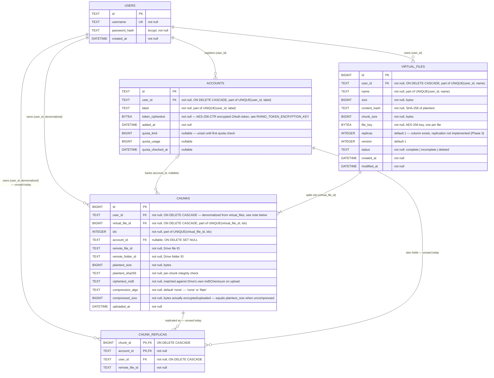

# Database ER Diagram

One shared **Postgres** database (e.g. Neon), used by both the web portal
(`rhino serve`) and the CLI (`rhino put/get/ls/rm/account/status`) — see
[`db/db.go`](../db/db.go) for the connection and
[`db/migrations/`](../db/migrations/) for the schema (managed by
[golang-migrate](https://github.com/golang-migrate/migrate), not GORM's
`AutoMigrate` — see "Why golang-migrate, not AutoMigrate" below). Queries
are written with [GORM](https://gorm.io) against the models in
[`backend/authdb/users.go`](../backend/authdb/users.go) and
[`drivepool/manifest/models.go`](../drivepool/manifest/models.go). This
replaces the earlier design (still visible in git history) of one SQLite
file per portal user plus a separate `users.db` — everything now lives in
one database, multi-tenant, isolated by a `user_id` column on every table.

### The tenant-isolation pattern

Every per-user table carries `user_id`, including `chunks`/`chunk_replicas`
even though it's reachable via `virtual_file_id`/`account_id` — this is
deliberate: stamping the tenant column onto *every* table means every
query filters the same way, with no table needing a join to scope safely.
On the Go side, `drivepool/manifest/manifest.go`'s `scoped(ctx, userID)`
helper is the *only* sanctioned way any method builds a query — it panics
on an empty `userID` rather than silently matching zero rows, so a caller
that forgot to resolve identity fails loudly instead of looking like "no
data yet." `Pool` (in `drivepool/pool.go`) pins `userID` once at
construction and threads it into every manifest call internally, so
callers (CLI commands, backend HTTP handlers) never pass it themselves.

Dedicated cross-tenant tests (`TestPoolsAreTenantIsolated`,
`TestAccountsAreTenantIsolated`, `TestVirtualFilesAreTenantIsolatedAndPerUserUnique`)
create data as one user and assert a different user's reads see nothing —
this is the actual regression backstop for the isolation guarantee, not
just the schema.

### Notes on relationships and constraints

- **`chunks.account_id` is nullable with `ON DELETE SET NULL`.** Removing
  an account nulls out this column on any chunk it was backing instead of
  failing or leaving a dangling reference — the chunk row survives (so
  `remote_file_id`/`remote_folder_id` bookkeeping isn't lost), it just
  loses the pointer to which account to ask for that data.
  `Pool.ListWithAccounts` renders such a chunk's drive as `"disconnected"`
  and marks the file `Degraded`. `Pool.RemoveAccount(ctx, label, force)`
  additionally guards this at the application level, ahead of the
  database constraint: by default it refuses to remove an account that
  still backs chunks for any non-`deleted` file (`ErrAccountInUse`), so
  disconnecting the wrong Drive fails fast with a clear reason instead of
  silently orphaning data — `force=true` (CLI `--force`, portal's
  "Disconnect anyway") skips that check and lets `ON DELETE SET NULL`
  take over.
- **OAuth tokens are encrypted at rest** (`accounts.token_ciphertext`),
  not stored as plaintext files the way the old per-installation SQLite
  design did — a shared, network-accessible database is a meaningfully
  bigger blast radius than a single machine's 0600 file if the connection
  string or a backup ever leaks. `RHINO_TOKEN_ENCRYPTION_KEY` (32 bytes,
  hex) is a hard requirement for both `rhino serve` and every CLI command
  — see `db.TokenEncryptionKeyFromEnv`.
- **`chunk_replicas` and `virtual_files.replicas` are schema-only.**
  Nothing in the codebase writes to `chunk_replicas` yet — each chunk is
  placed on exactly one account today. Splitting/replicating across
  multiple accounts is tracked as Phase 3 in `tasks/modification_plan.md`.
- **Chunk compression is transparent and per-chunk.** Before a chunk's
  plaintext is encrypted (`drivepool.Pool.uploadChunk`), it's compressed
  with raw DEFLATE (`storage.CompressBytes`) and the compressed form is
  kept only if it's actually smaller — already-compressed content (media,
  archives) is left as-is rather than paying a CPU cost for no space
  savings. The decision is recorded per chunk in `compression_algo`/
  `compressed_size`, so a single file's chunks can be a mix of compressed
  and uncompressed. `plaintext_size`/`plaintext_sha256` always describe the
  original, uncompressed bytes — unaffected by this. See
  [`compression.md`](compression.md) for the full design.
- **Content addressing**: `virtual_files.content_hash` is a SHA-256 of the
  whole plaintext file, checked once by `GetStream` after all chunks are
  reassembled; `chunks.plaintext_sha256` is the same idea per-chunk. This
  is unrelated to the separate P2P subsystem's SHA-1 CAS scheme
  (`storage.CASPathTransformFunc`) — the two subsystems share the
  `storage` package's crypto helpers but not its path/hash scheme.

### Why golang-migrate, not AutoMigrate

GORM's `AutoMigrate` was deliberately not used for schema management. This
schema's security-load-bearing constraints (`UNIQUE(user_id, ...)`, the
FK cascade/set-null rules the tenant-isolation guarantee depends on) need
to be reviewable in a plain SQL diff, not re-inferred from Go struct tags
against a live database on every process start — and `AutoMigrate` never
drops or renames columns and has no rollback story. `db.Migrate` (in
[`db/migrate.go`](../db/migrate.go)) applies the numbered SQL files under
`db/migrations/` instead, embedded into the binary via `go:embed`, run
idempotently at startup by both `rhino serve` and every CLI invocation.

### CLI identity

The CLI has no login of its own — `--user`/`RHINO_USER` names a row in the
same `users` table the web portal's session login uses
(`authdb.GetOrCreateCLIUser`). Pointing it at an existing portal username
makes the CLI operate on that person's real data (visible in their
dashboard too); a fresh name auto-provisions a CLI-only identity with a
random, structurally-valid-but-unusable password hash, so it can never log
into the portal itself. There's no default identity — an unset `--user`
is a hard error, since a shared machine with an implicit default user is
exactly the kind of mistake that leaks one person's files into another's
view.
